# Activity Diagram - Laundry Management System (Simplified)

Activity Diagram yang disederhanakan dengan fokus pada interaksi antara User dan Sistem.

## 1. Activity Diagram - Buat Transaksi

### Format Mermaid

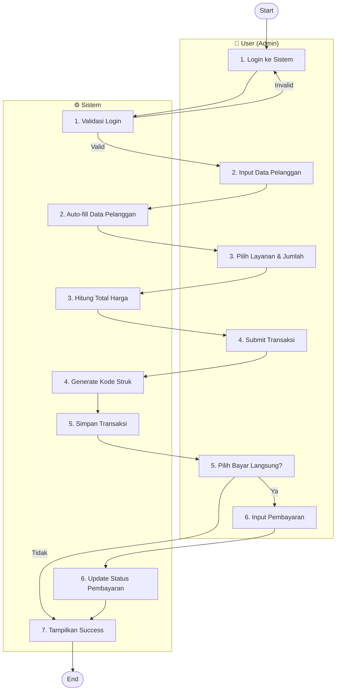

### Format PlantUML

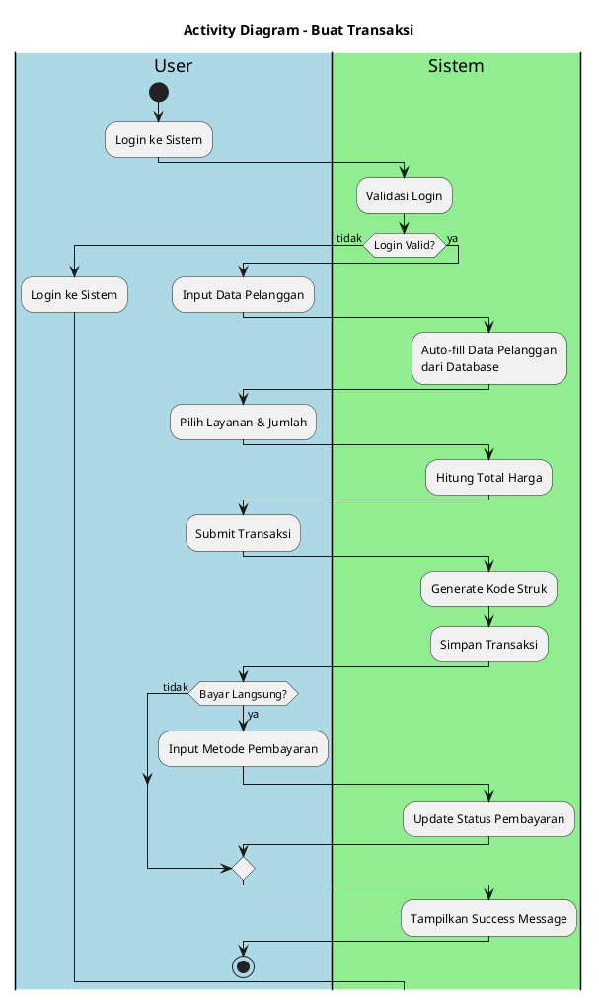

---

## 2. Activity Diagram - Update Status Transaksi

### Format Mermaid

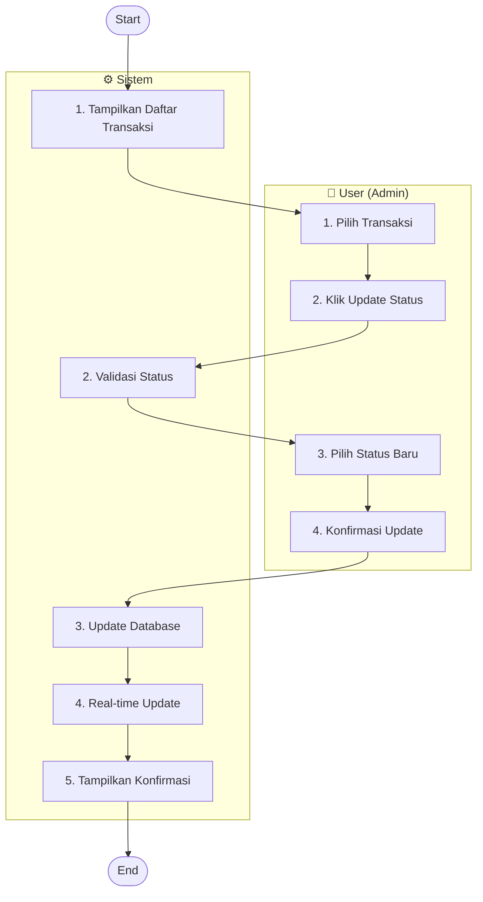

### Format PlantUML

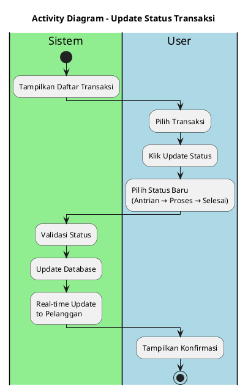

---

## 3. Activity Diagram - Update Status Pembayaran

### Format Mermaid

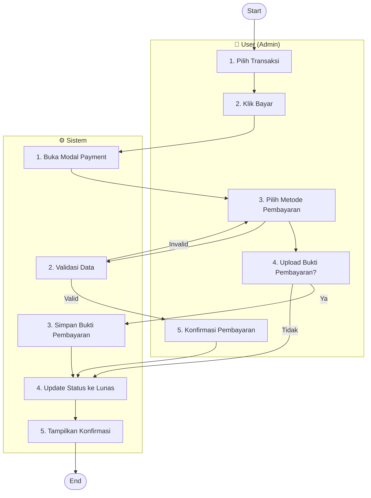

### Format PlantUML

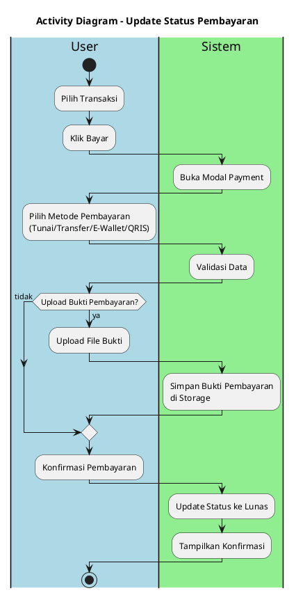

---

## 4. Activity Diagram - Cek Status Transaksi (Pelanggan)

### Format Mermaid

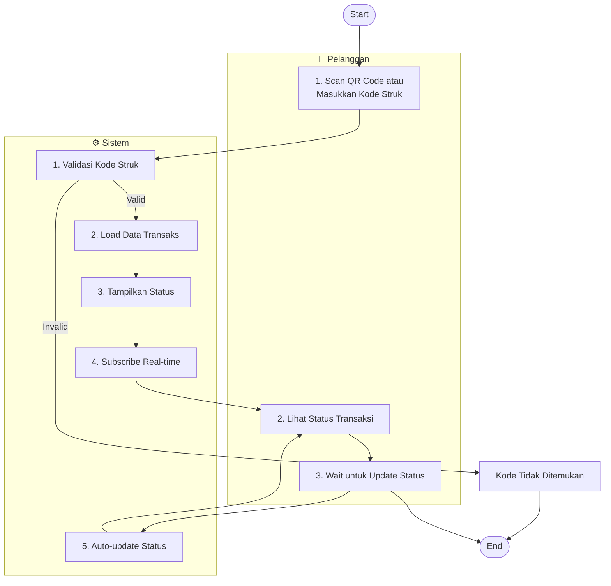

### Format PlantUML

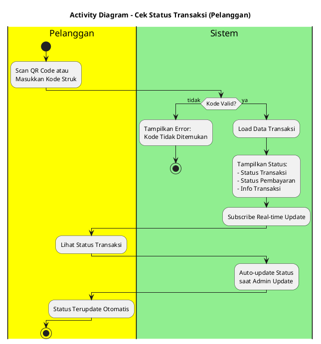

---

## 5. Activity Diagram - Login & Register

### Format Mermaid

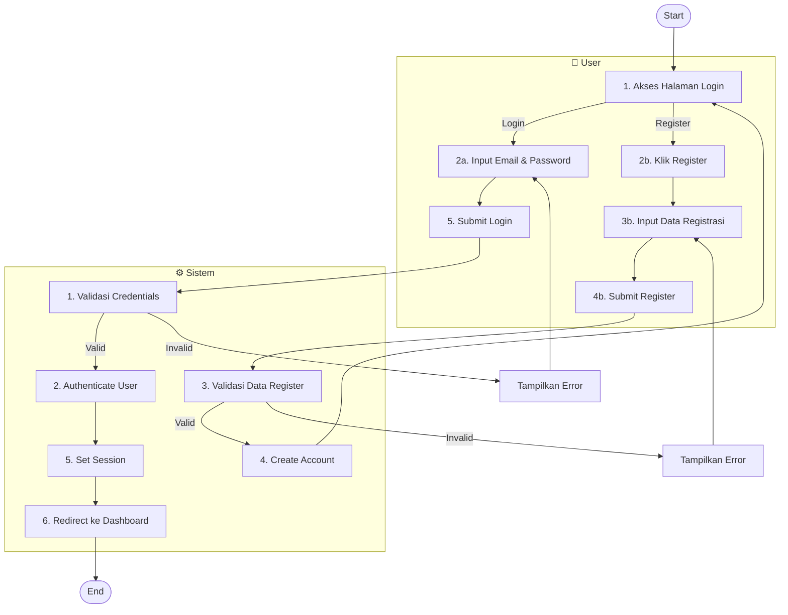

### Format PlantUML

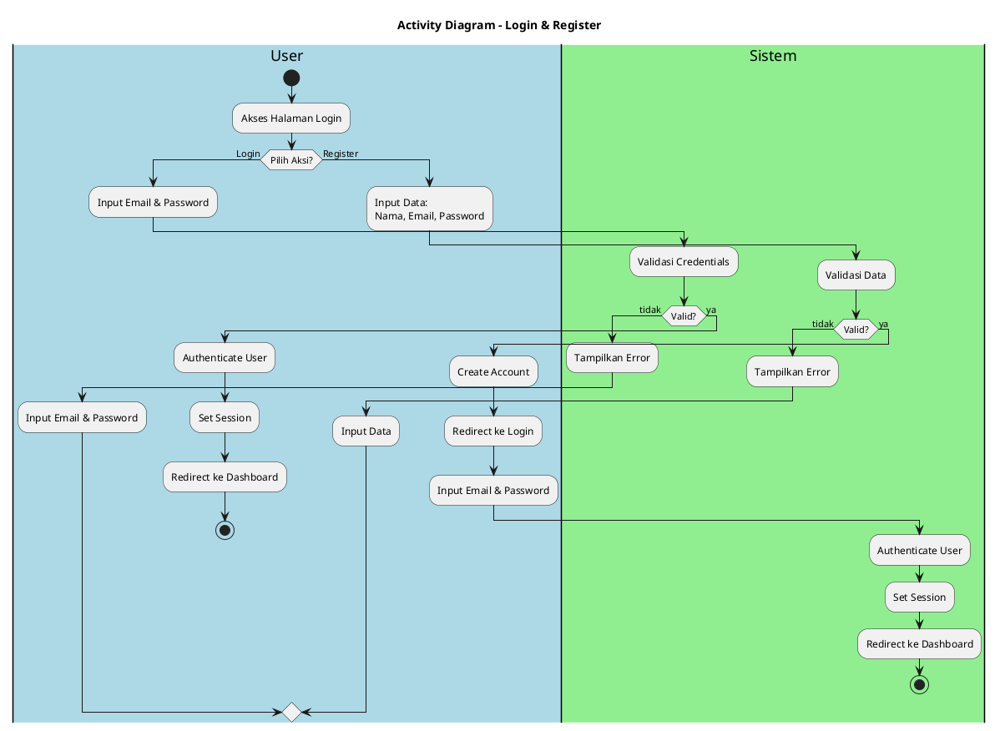

---

## 6. Activity Diagram - Manajemen Pengeluaran

### Format Mermaid

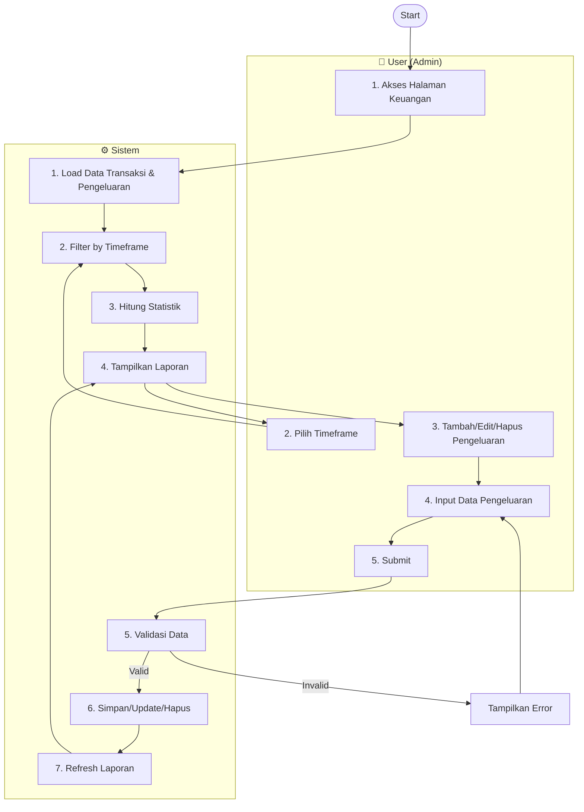

### Format PlantUML

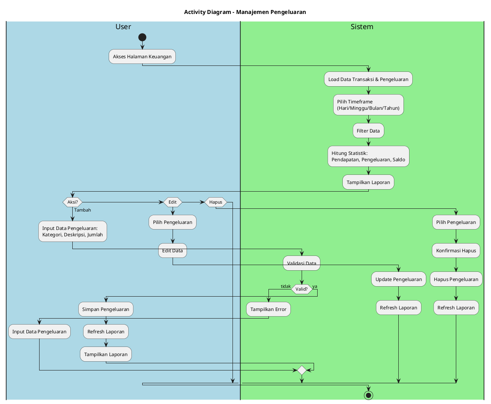

---

## Cara Menggunakan

### Mermaid
- **GitHub/GitLab**: Copy langsung ke file `.md`
- **Notion**: Gunakan block `/mermaid`
- **VS Code**: Install "Markdown Preview Mermaid Support"
- **Online**: [Mermaid Live Editor](https://mermaid.live)

### PlantUML
- **VS Code**: Install extension "PlantUML"
- **IntelliJ**: Built-in support
- **Online**: [PlantUML Web Server](http://www.plantuml.com/plantuml/uml/)
- **Draw.io**: Import dari text
