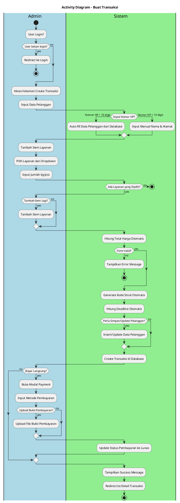
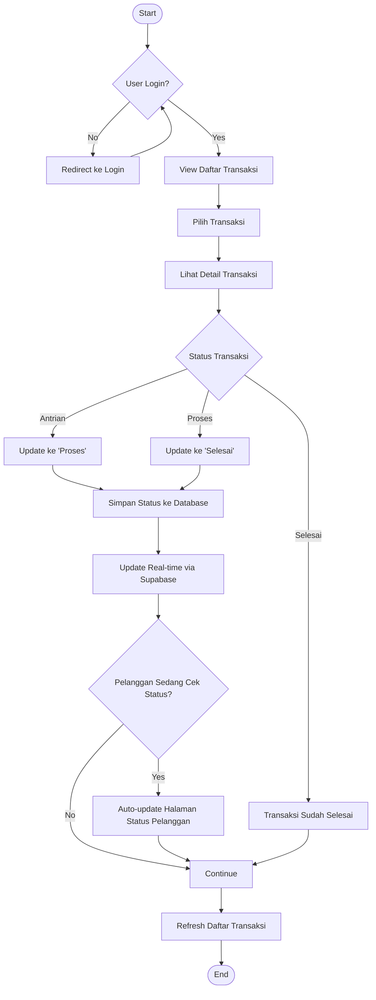
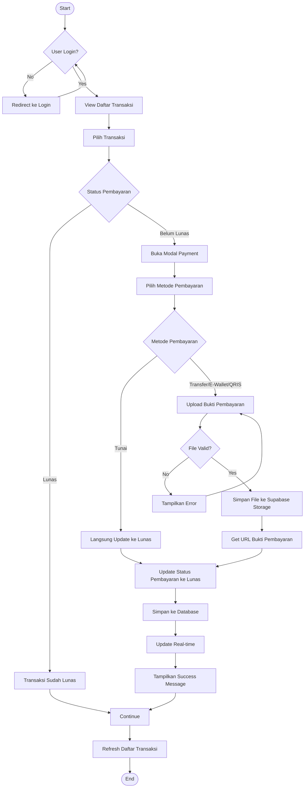
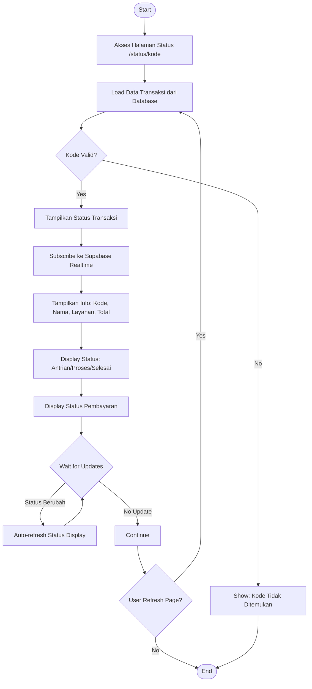
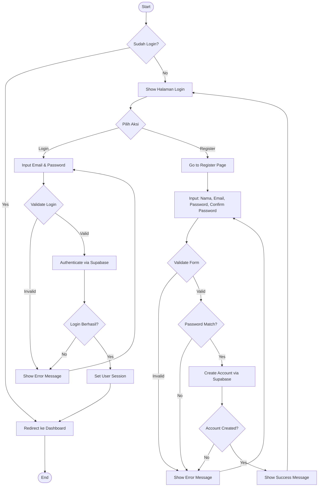
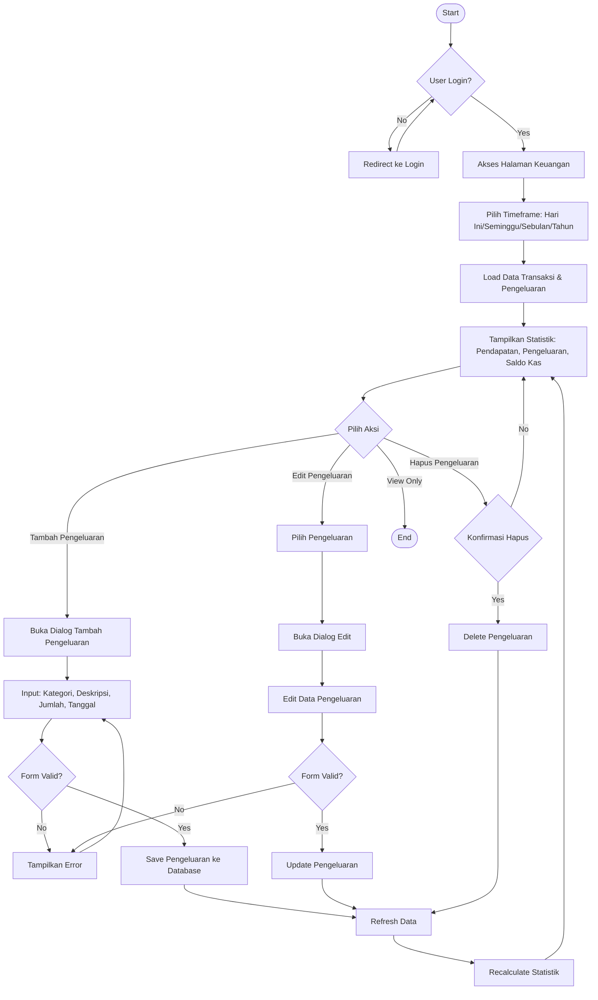

# Activity Diagram - Laundry Management System

## Activity Diagram untuk Use Case Utama

### 1. Activity Diagram - Buat Transaksi

#### Format Mermaid

```mermaid
flowchart TD
    Start([Start]) --> Login{User Login?}
    Login -->|No| Redirect[Redirect ke Login]
    Redirect --> Login
    Login -->|Yes| Access[Akses Halaman Create Transaksi]
    Access --> InputPelanggan[Input Data Pelanggan]
    InputPelanggan --> CheckNomorHP{Input Nomor HP}
    CheckNomorHP -->|Nomor HP > 10 digit| AutoFill[Auto-fill Data Pelanggan dari Database]
    CheckNomorHP -->|Nomor HP < 10 digit| ManualInput[Input Manual Nama & Alamat]
    AutoFill --> AddItem[Tambah Item Layanan]
    ManualInput --> AddItem
    AddItem --> PilihLayanan[Pilih Layanan dari Dropdown]
    PilihLayanan --> InputJumlah[Input Jumlah kg/pcs]
    InputJumlah --> CheckLayanan{Ada Layanan yang Dipilih?}
    CheckLayanan -->|No| PilihLayanan
    CheckLayanan -->|Yes| AddMoreItem{Tambah Item Lagi?}
    AddMoreItem -->|Yes| AddItem
    AddMoreItem -->|No| CalculateTotal[Hitung Total Harga Otomatis]
    CalculateTotal --> CheckForm{Form Valid?}
    CheckForm -->|No| ShowError[Tampilkan Error Message]
    ShowError --> InputPelanggan
    CheckForm -->|Yes| GenerateKode[Generate Kode Struk Otomatis]
    GenerateKode --> CalculateDeadline[Hitung Deadline Otomatis]
    CalculateDeadline --> SavePelanggan{Perlu Simpan/Update Pelanggan?}
    SavePelanggan -->|Yes| InsertPelanggan[Insert/Update Data Pelanggan]
    SavePelanggan -->|No| CreateTransaksi
    InsertPelanggan --> CreateTransaksi[Create Transaksi di Database]
    CreateTransaksi --> CheckPayment{Bayar Langsung?}
    CheckPayment -->|Yes| OpenPayment[Buka Modal Payment]
    CheckPayment -->|No| ShowSuccess[Tampilkan Success Message]
    OpenPayment --> InputPayment[Input Metode Pembayaran]
    InputPayment --> UploadBukti{Upload Bukti Pembayaran?}
    UploadBukti -->|Yes| UploadFile[Upload File Bukti Pembayaran]
    UploadBukti -->|No| UpdatePayment
    UploadFile --> UpdatePayment[Update Status Pembayaran ke Lunas]
    UpdatePayment --> ShowSuccess
    ShowSuccess --> RedirectDetail[Redirect ke Detail Transaksi]
    RedirectDetail --> End([End])
```

#### Format PlantUML

---

### 2. Activity Diagram - Update Status Transaksi

#### Format Mermaid

---

### 3. Activity Diagram - Update Status Pembayaran

#### Format Mermaid

---

### 4. Activity Diagram - Cek Status Transaksi (Pelanggan)

#### Format Mermaid

---

### 5. Activity Diagram - Login & Register

#### Format Mermaid

---

### 6. Activity Diagram - Manajemen Pengeluaran

#### Format Mermaid

---

## Format PlantUML - Semua Activity Diagram

File terpisah dengan format PlantUML lengkap dapat dibuat sesuai kebutuhan.

## Cara Menggunakan

### Mermaid Diagram
1. **GitHub/GitLab**: Copy-paste langsung ke README.md atau file markdown
2. **Notion**: Gunakan `/mermaid` block
3. **VS Code**: Install extension "Markdown Preview Mermaid Support"
4. **Online**: [Mermaid Live Editor](https://mermaid.live)

### PlantUML Diagram
1. **VS Code**: Install extension "PlantUML"
2. **Online**: [PlantUML Web Server](http://www.plantuml.com/plantuml/uml/)
3. **Draw.io**: Import atau copy-paste code
4. **IntelliJ IDEA**: Built-in support

