# Use Case Diagram - Laundry Management System

## Actor
- **Admin/Staff**: Pengguna yang mengelola sistem laundry
- **Pelanggan**: Pengguna yang menggunakan layanan laundry (public access)

## Use Case Diagram

### Format Mermaid (untuk GitHub, Notion, dll)

```mermaid
graph TB
    Admin[Admin/Staff]
    Pelanggan[Pelanggan]
    
    subgraph "Authentication"
        UC1[Register]
        UC2[Login]
        UC3[Logout]
    end
    
    subgraph "Manajemen Layanan"
        UC4[View Layanan]
        UC5[Create Layanan]
        UC6[Update Layanan]
        UC7[Delete Layanan]
    end
    
    subgraph "Manajemen Pelanggan"
        UC8[View Pelanggan]
        UC9[Create Pelanggan]
        UC10[Update Pelanggan]
        UC11[Delete Pelanggan]
        UC12[Search Pelanggan]
    end
    
    subgraph "Manajemen Transaksi"
        UC13[View Transaksi]
        UC14[Create Transaksi]
        UC15[Update Status Transaksi]
        UC16[Update Status Pembayaran]
        UC17[View Detail Transaksi]
        UC18[Generate Struk]
        UC19[Generate QR Code]
        UC20[Kirim Struk via WhatsApp]
        UC21[Search Transaksi]
    end
    
    subgraph "Keuangan"
        UC22[View Laporan Keuangan]
        UC23[Manajemen Pengeluaran]
        UC24[View Statistik]
    end
    
    subgraph "Public Features"
        UC25[Cek Status Transaksi]
        UC26[View QR Code]
    end
    
    Admin --> UC1
    Admin --> UC2
    Admin --> UC3
    Admin --> UC4
    Admin --> UC5
    Admin --> UC6
    Admin --> UC7
    Admin --> UC8
    Admin --> UC9
    Admin --> UC10
    Admin --> UC11
    Admin --> UC12
    Admin --> UC13
    Admin --> UC14
    Admin --> UC15
    Admin --> UC16
    Admin --> UC17
    Admin --> UC18
    Admin --> UC19
    Admin --> UC20
    Admin --> UC21
    Admin --> UC22
    Admin --> UC23
    Admin --> UC24
    
    Pelanggan --> UC25
    Pelanggan --> UC26
```

### Format PlantUML (untuk draw.io, PlantUML tools)

```plantuml
@startuml
left to right direction

actor "Admin/Staff" as Admin
actor "Pelanggan" as Pelanggan

rectangle "Laundry Management System" {
    
    package "Authentication" {
        usecase "Register" as UC1
        usecase "Login" as UC2
        usecase "Logout" as UC3
    }
    
    package "Manajemen Layanan" {
        usecase "View Layanan" as UC4
        usecase "Create Layanan" as UC5
        usecase "Update Layanan" as UC6
        usecase "Delete Layanan" as UC7
    }
    
    package "Manajemen Pelanggan" {
        usecase "View Pelanggan" as UC8
        usecase "Create Pelanggan" as UC9
        usecase "Update Pelanggan" as UC10
        usecase "Delete Pelanggan" as UC11
        usecase "Search Pelanggan" as UC12
    }
    
    package "Manajemen Transaksi" {
        usecase "View Transaksi" as UC13
        usecase "Create Transaksi" as UC14
        usecase "Update Status Transaksi" as UC15
        usecase "Update Status Pembayaran" as UC16
        usecase "View Detail Transaksi" as UC17
        usecase "Generate Struk" as UC18
        usecase "Generate QR Code" as UC19
        usecase "Kirim Struk via WhatsApp" as UC20
        usecase "Search Transaksi" as UC21
    }
    
    package "Keuangan" {
        usecase "View Laporan Keuangan" as UC22
        usecase "Manajemen Pengeluaran" as UC23
        usecase "View Statistik" as UC24
    }
    
    package "Public Features" {
        usecase "Cek Status Transaksi" as UC25
        usecase "View QR Code" as UC26
    }
}

' Admin use cases
Admin --> UC1
Admin --> UC2
Admin --> UC3
Admin --> UC4
Admin --> UC5
Admin --> UC6
Admin --> UC7
Admin --> UC8
Admin --> UC9
Admin --> UC10
Admin --> UC11
Admin --> UC12
Admin --> UC13
Admin --> UC14
Admin --> UC15
Admin --> UC16
Admin --> UC17
Admin --> UC18
Admin --> UC19
Admin --> UC20
Admin --> UC21
Admin --> UC22
Admin --> UC23
Admin --> UC24

' Pelanggan use cases
Pelanggan --> UC25
Pelanggan --> UC26

@enduml
```

## Deskripsi Use Case

### Authentication
- **Register**: Admin mendaftarkan akun baru
- **Login**: Admin masuk ke sistem
- **Logout**: Admin keluar dari sistem

### Manajemen Layanan
- **View Layanan**: Melihat daftar layanan laundry
- **Create Layanan**: Menambahkan layanan baru (kiloan/satuan)
- **Update Layanan**: Mengubah data layanan
- **Delete Layanan**: Menghapus layanan

### Manajemen Pelanggan
- **View Pelanggan**: Melihat daftar pelanggan
- **Create Pelanggan**: Menambahkan pelanggan baru
- **Update Pelanggan**: Mengubah data pelanggan
- **Delete Pelanggan**: Menghapus pelanggan
- **Search Pelanggan**: Mencari pelanggan berdasarkan nama/nomor HP

### Manajemen Transaksi
- **View Transaksi**: Melihat daftar transaksi
- **Create Transaksi**: Membuat transaksi baru dengan auto-generate kode struk
- **Update Status Transaksi**: Mengubah status (antrian → proses → selesai)
- **Update Status Pembayaran**: Mengubah status pembayaran (belum_lunas → lunas)
- **View Detail Transaksi**: Melihat detail lengkap transaksi
- **Generate Struk**: Mencetak/menampilkan struk transaksi
- **Generate QR Code**: Membuat QR code untuk tracking status
- **Kirim Struk via WhatsApp**: Mengirim struk ke pelanggan via WhatsApp
- **Search Transaksi**: Mencari transaksi berdasarkan nama/kode/QR

### Keuangan
- **View Laporan Keuangan**: Melihat laporan pendapatan dan pengeluaran
- **Manajemen Pengeluaran**: CRUD pengeluaran usaha
- **View Statistik**: Melihat statistik keuangan (hari ini, minggu ini, bulan ini, tahun ini)

### Public Features
- **Cek Status Transaksi**: Pelanggan dapat mengecek status tanpa login
- **View QR Code**: Melihat QR code untuk tracking

